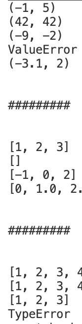
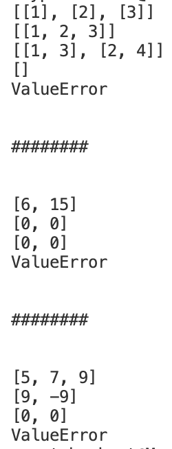
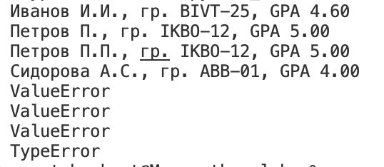

# Лабораторная работа №2

Работа со списками, матрицами и кортежами в Python.

---

## Задание A — `arrays.py`

### Функции:

#### `min_max(nums: list[float | int]) -> tuple[float | int, float | int]`
Возвращает кортеж из минимального и максимального элемента списка.
- Для пустого списка возвращает `"ValueError"`(сделал текстом, чтобы было более читабельно, про raise знаю)

#### `unique_sorted(nums: list[float | int]) -> list[float | int]`
Удаляет дубликаты из списка и возвращает отсортированный результат.
- Использует метод set для удаления повторяющихся элементов
- Результат сортируется по возрастанию

#### `flatten(mat: list[list | tuple]) -> list`
Преобразует вложенную структуру (список списков/кортежей) в одномерный отсортированный список.
- Если элемент не является списком или кортежем, возвращает "TypeError"
- Результат автоматически сортируется

### Результат выполнения:



---

## Задание B — `matrix.py`

Работа с прямоугольными матрицами (все строки одинаковой длины).

### Функции:

#### `transpose(mat: list[list[float | int]]) -> list[list]`
Транспонирование матрицы — меняет строки и столбцы местами.
- Пустая матрица [] → []
- Для "рваной" матрицы возвращает "ValueError"

#### `row_sums(mat: list[list[float | int]]) -> list[float]`
Вычисляет сумму элементов по каждой строке.
- Требует прямоугольную матрицу
- Возвращает список сумм

#### `col_sums(mat: list[list[float | int]]) -> list[float]`
Вычисляет сумму элементов по каждому столбцу.
- Требует прямоугольную матрицу
- Возвращает список сумм

### Результат выполнения:



---

## Задание C — `tuples.py`

Работа с записями студентов как с кортежами.

### Формат записи:
```
(fio: str, group: str, gpa: float)
```

### Функция:

#### `format_record(rec: tuple[str, str, float]) -> str`
Форматирует запись студента в красивую строку.

**Формат вывода:**
```
Фамилия И.О., гр. ГРУППА, GPA X.XX
```

**Функционал:**
- Автоматически формирует инициалы из ФИО
- Убирает лишние пробелы и "ест" множественные пробелы
- Приводит фамилию к правильному регистру (`capitalize()`)
- GPA выводится с 2 знаками после запятой
- Для некорректных данных возвращает "ValueError" или `"TypeError"

### Результат выполнения:




