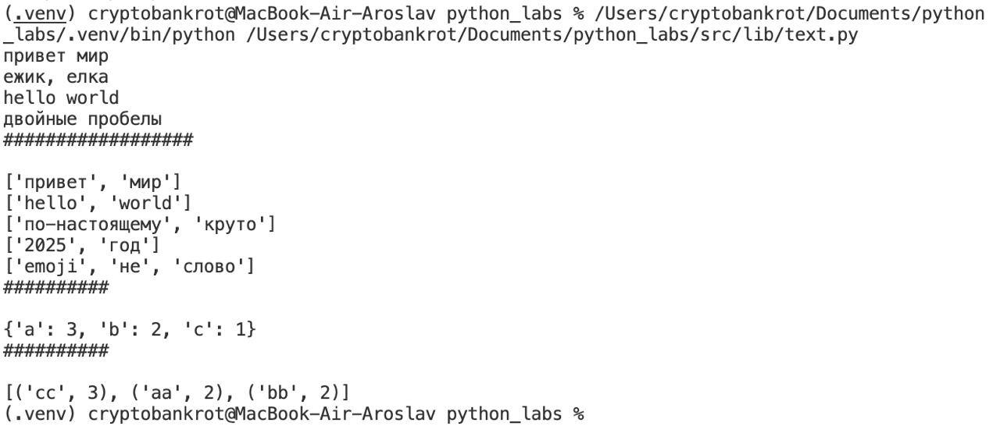
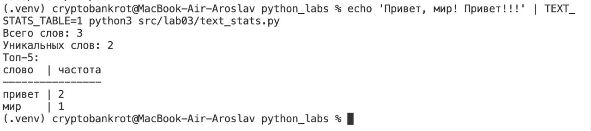

### Описание `src/lib/text.py`

- **normalize(input_text, apply_casefold=True, yo_to_e=True)**: нормализует текст
  - приводит к нижнему регистру (casefold)
  - заменяет `ё/Ё` на `е/Е`
  - схлопывает последовательности пробелов/переводов строк в одиночные пробелы
- **tokenize(input_text)**: разбивает строку на токены-слова
  - буквы/цифры/`_` внутри слова; допускает дефис внутри слова (например: `по-настоящему`)
- **count_freq(tokens)**: считает частоты встречаемости слов
- **top_n(freq_map, n=5)**: возвращает топ-N слов по убыванию частоты, при равенстве — лексикографически

Иллюстрация к работе функций:



### Описание `src/lab03/text_stats.py`

Скрипт читает текст со стандартного ввода, нормализует, токенизирует, считает общее число слов, число уникальных слов и печатает топ-5 слов с количеством вхождений.

- Базовый режим (по умолчанию):
  ```
  слово:частота
  ```
- Табличный режим: выравненная таблица со столбцами `слово | частота`.
  Включается переменной окружения `TEXT_STATS_TABLE=1`.

Примеры запуска:

```bash
echo 'Привет, мир! Привет!!!' | python3 src/lab03/text_stats.py
echo 'Привет, мир! Привет!!!' | TEXT_STATS_TABLE=1 python3 src/lab03/text_stats.py
```

Иллюстрация к работе `text_stats.py`:




