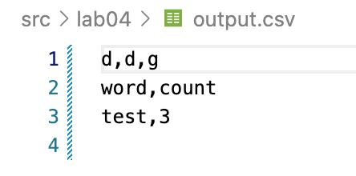
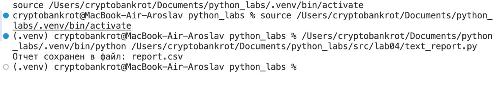
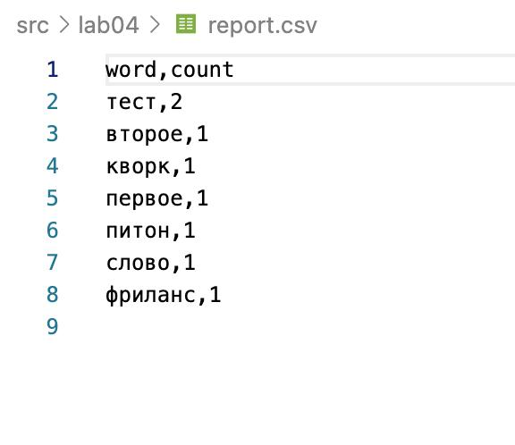

# 📊 Лабораторная работа 4: Работа с текстовыми файлами и CSV

## 📋 Описание

Эта лабораторная работа посвящена работе с текстовыми файлами и созданию отчетов в формате CSV. Работа включает два основных задания по обработке текстовых данных.

## 📁 Структура проекта

```
src/lab04/
├── README.md           # Этот файл
├── io_txt_csv.py      # A: базовые операции с файлами
├── text_report.py     # B: анализ текста и создание отчетов
├── output.csv         # Результат первого задания
└── report.csv         # Результат второго задания
```

## 🎯 Задания

### 📝 Задание A: Базовые операции с файлами (01.jpg & 02.jpg)




**Файл:** `io_txt_csv.py`

**Функции:**
- `read_text(path, encoding="utf-8")` - чтение текста из файла в одну строку
- `write_csv(rows, path, header=None)` - создание/перезапись CSV файла с проверкой длины строк

**Результат:** `output.csv` - CSV файл

### 📊 Задание B: Анализ файлов и создание отчетов (03.jpg, 04.jpg, 05.jpg)





**Файл:** `text_report.py`

**Функции:**
- `read_text(path, encoding="utf-8")` - чтение текста с обработкой ошибки(несуществующий файл)
- `frequencies_from_text(text)` - подсчет частоты слов в тексте
- `sorted_word_counts(freq)` - сортировка слов по частоте использования
- `write_report_to_csv(word_counts, path)` - создание отчета в CSV формате

**Результат:** `report.csv` - статистический отчет по частоте слов

## 📈 Примеры работы

### Входные данные (`data/samples/input.txt`):
```
первое второе слово
тест тест питон
кворк фриланс
```

### Результат анализа (`report.csv`):
```csv
word,count
тест,2
второе,1
кворк,1
первое,1
питон,1
слово,1
фриланс,1
```
