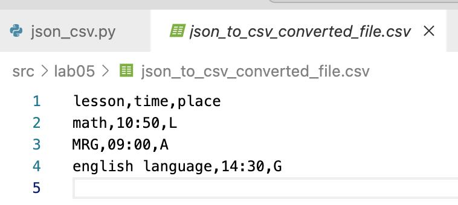
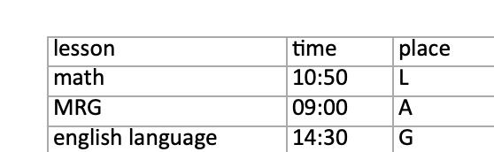

## Задание A

```python
import json
import csv

def json_to_csv(json_path: str, csv_path: str) -> None:
    """
    Преобразует JSON-файл в CSV.
    Поддерживает список словарей [{...}, {...}], заполняет отсутствующие поля пустыми строками.
    Кодировка UTF-8. Порядок колонок — как в первом объекте или алфавитный (указать в README).
    """
    if json_path[-4::] != 'json' or csv_path[-3::] != 'csv':
        raise TypeError
    with open(json_path, encoding="utf-8") as f: 
        data = json.load(f)
    if not data or type(data[0]) != dict:
        raise ValueError("Пустой JSON или неподдерживаемая структура")
    with open(csv_path, "w", newline="", encoding="utf-8") as cf:
        writer = csv.DictWriter(cf, fieldnames=list(data[0].keys()))
        writer.writeheader()
        writer.writerows(data)


json_to_csv('data/samples/test.json', 'src/lab05/json_to_csv_converted_file.csv')


def csv_to_json(csv_path: str, json_path: str) -> None:
    """
    Преобразует CSV в JSON (список словарей).
    Заголовок обязателен, значения сохраняются как строки.
    json.dump(..., ensure_ascii=False, indent=2)
    """
    if csv_path[-3::] != 'csv' or json_path[-4::] != 'json':
        raise TypeError
    lt_rows = []
    with open(csv_path, 'r', encoding='utf-8', newline='') as cf:
        reader = csv.DictReader(cf)
        for row in reader:
            lt_rows.append(row)
        if not lt_rows:
            raise ValueError
    with open(json_path, 'w', encoding='utf-8') as jf:
        json.dump(lt_rows, jf, ensure_ascii=False, indent=2)


csv_to_json('data/samples/test.csv', 'src/lab05/csv_to_json_example.json')
```


Сделана проверка через срез `[-4::] != '.json'`
Открываем и проверяем, что он не пустой и проверяем тип первого вхождения(должен быть словарь)


Точно также проверяем тип входных данных
# Задание B
```python
from openpyxl import Workbook
import csv

def csv_to_xlsx(csv_path: str, xlsx_path: str) -> None:
    """
    Конвертирует CSV в XLSX.
    Использовать openpyxl ИЛИ xlsxwriter.
    Первая строка CSV — заголовок.
    Лист называется "Sheet1".
    Колонки — автоширина по длине текста (не менее 8 символов).
    """
    wb = Workbook()
    ws = wb.active
    ws.title = "Sheet1"
    
    with open(csv_path, encoding="utf-8") as f:
        for row in csv.reader(f):
                ws.append(row)
        for column in ws.columns:
            mx = 0
            column_letter = column[0].column_letter
            for cell in column:
                mx = max(mx, len(cell.value))
            new_width = max(mx + 2, 8)
            ws.column_dimensions[column_letter].width = new_width
    
    wb.save(xlsx_path)
csv_to_xlsx('data/samples/test.csv', 'src/lab05/csv_to_xlsx.xlsx')
```
открываем лист, через append записываем строки
после проходимся по колонкам и ищем максимальную длину содержимого строк(для установления ширины каждого столбца)

после ставим в настройках эту ширину


