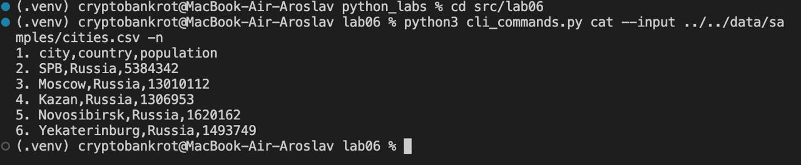
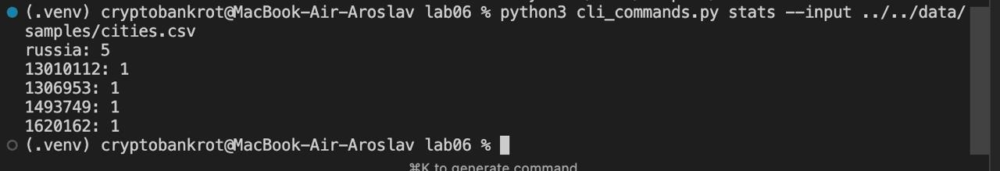
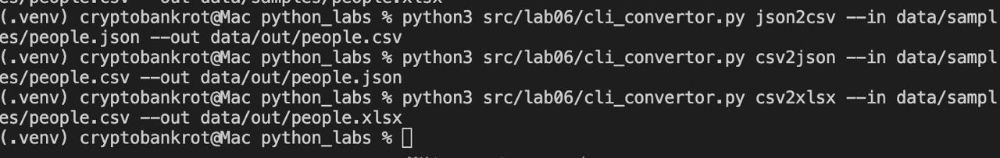

## Задание A

```python
import argparse
import os
import sys
from pathlib import Path

sys.path.append(os.path.abspath(os.path.join(os.path.dirname(__file__), '..')))

from lab04.text_report import frequencies_from_text, sorted_word_counts


def main():
    parser = argparse.ArgumentParser(description="CLI‑утилиты лабораторной №6")
    subparsers = parser.add_subparsers(dest="command")

    # подкоманда cat
    cat_parser = subparsers.add_parser("cat", help="Вывести содержимое файла")
    cat_parser.add_argument("--input", required=True)
    cat_parser.add_argument("-n", action="store_true", help="Нумеровать строки")

    # подкоманда stats
    stats_parser = subparsers.add_parser("stats", help="Частоты слов")
    stats_parser.add_argument("--input", required=True)
    stats_parser.add_argument("--top", type=int, default=5)

    args = parser.parse_args()
    # print(args)
    if args.command == "cat":
        for i, line in enumerate(Path(args.input).read_text(encoding='utf-8').split()):
            print(f"{i + 1}. {line}" if args.n else line)
    elif args.command == "stats":
        new_str = Path(args.input).read_text(encoding='utf-8')
        sorted_list = sorted_word_counts(frequencies_from_text(new_str))
        for word, count in sorted_list[:args.top]:
            print(f"{word}: {count}")


if __name__ == "__main__":
    main()
```


Парсятся аргументы и выполняется код, ничего особенного


## Задание B

```python
import argparse
import os
import sys

sys.path.append(os.path.abspath(os.path.join(os.path.dirname(__file__), '..')))

from lab05.json_csv import json_to_csv, csv_to_json
from lab05.csv_xlsx import csv_to_xlsx

def main():
    parser = argparse.ArgumentParser(description="Конвертеры данных")
    sub = parser.add_subparsers(dest="command")

    p1 = sub.add_parser("json2csv")
    p1.add_argument("--in", dest="input", required=True)
    p1.add_argument("--out", dest="output", required=True)

    p2 = sub.add_parser("csv2json")
    p2.add_argument("--in", dest="input", required=True)
    p2.add_argument("--out", dest="output", required=True)

    p3 = sub.add_parser("csv2xlsx")
    p3.add_argument("--in", dest="input", required=True)
    p3.add_argument("--out", dest="output", required=True)

    args = parser.parse_args()
    if args.command == "json2csv":
        json_to_csv(args.input, args.output)    
    elif args.command == "csv2json":
        csv_to_json(args.input, args.output)
    elif args.command == "csv2xlsx":
        csv_to_xlsx(args.input, args.output)

if __name__ == "__main__":
    main()
```

Парсим аргументы и вызываем функции из ЛР5