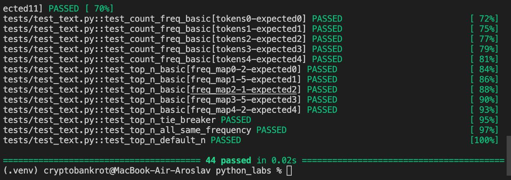
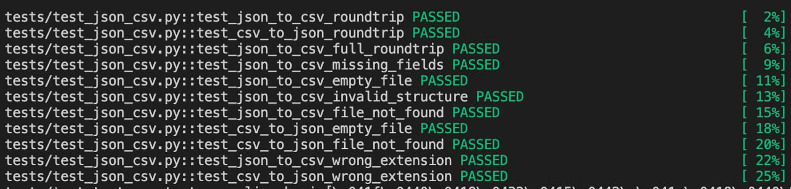

# Лабараторная работа №7


# Задание A
```python
import pytest
from src.lib.text import normalize, tokenize, count_freq, top_n


@pytest.mark.parametrize(
    "source, expected",
    [
        ("ПрИвЕт\nМИр\t", "привет мир"),
        ("ёжик, Ёлка", "ежик, елка"),
        ("Hello\r\nWorld", "hello world"),
        ("  двойные   пробелы  ", "двойные пробелы"),
        ("", ""),
        ("   ", ""),
        ("Один", "один"),
        ("МНОГО\t\t\tПРОБЕЛОВ\n\n\n", "много пробелов"),
    ],
)
def test_normalize_basic(source, expected):
    assert normalize(source) == expected


@pytest.mark.parametrize(
    "source, expected",
    [
        ("привет мир", ["привет", "мир"]),
        ("hello,world!!!", ["hello", "world"]),
        ("по-настоящему круто", ["по-настоящему", "круто"]),
        ("2025 год", ["2025", "год"]),
        ("emoji 😀 не слово", ["emoji", "не", "слово"]),
        ("", []),
        ("   ", []),
        ("word1_word2", ["word1_word2"]),
        ("test-test", ["test-test"]),
        ("a-b-c", ["a-b-c"]),
        ("-неправильно", ["неправильно"]),
        ("правильно-", ["правильно"]),
    ],
)
def test_tokenize_basic(source, expected):
    assert tokenize(source) == expected


@pytest.mark.parametrize(
    "tokens, expected",
    [
        (["a", "b", "a", "c", "b", "a"], {"a": 3, "b": 2, "c": 1}),
        ([], {}),
        (["word"], {"word": 1}),
        (["a", "a", "a"], {"a": 3}),
        (["one", "two", "three"], {"one": 1, "two": 1, "three": 1}),
    ],
)
def test_count_freq_basic(tokens, expected):
    assert count_freq(tokens) == expected


@pytest.mark.parametrize(
    "freq_map, n, expected",
    [
        ({"a": 3, "b": 2, "c": 1}, 2, [("a", 3), ("b", 2)]),
        ({"a": 3, "b": 2, "c": 1}, 5, [("a", 3), ("b", 2), ("c", 1)]),
        ({"word": 1}, 1, [("word", 1)]),
        ({}, 5, []),
        ({"a": 1, "b": 1, "c": 1}, 2, [("a", 1), ("b", 1)]),
    ],
)
def test_top_n_basic(freq_map, n, expected):
    assert top_n(freq_map, n) == expected


def test_top_n_tie_breaker():
    """Проверка сортировки по алфавиту при равных значениях частоты"""
    freq_map = {"bb": 2, "aa": 2, "cc": 3, "dd": 2}
    result = top_n(freq_map, 4)
    assert result == [("cc", 3), ("aa", 2), ("bb", 2), ("dd", 2)]


def test_top_n_all_same_frequency():
    """Все слова с одинаковой частотой - сортировка по алфавиту"""
    freq_map = {"zebra": 1, "apple": 1, "banana": 1}
    result = top_n(freq_map, 3)
    assert result == [("apple", 1), ("banana", 1), ("zebra", 1)]


def test_top_n_default_n():
    """Проверка значения по умолчанию n=5"""
    freq_map = {"a": 1, "b": 2, "c": 3, "d": 4, "e": 5, "f": 6}
    result = top_n(freq_map)
    assert len(result) == 5
    assert result[0] == ("f", 6)
```



# Задание B

```python
import pytest
import json
import csv
from pathlib import Path
from src.lab05.json_csv import json_to_csv, csv_to_json


def test_json_to_csv_roundtrip(tmp_path: Path):
    """Позитивный тест: JSON → CSV → проверка структуры"""
    src = tmp_path / "people.json"
    dst = tmp_path / "people.csv"
    data = [
        {"name": "Alice", "age": 22},
        {"name": "Bob", "age": 25},
    ]
    src.write_text(json.dumps(data, ensure_ascii=False, indent=2), encoding="utf-8")
    json_to_csv(str(src), str(dst))

    with dst.open(encoding="utf-8") as f:
        rows = list(csv.DictReader(f))

    assert len(rows) == 2
    assert {"name", "age"} <= set(rows[0].keys())
    assert rows[0]["name"] == "Alice"
    assert rows[0]["age"] == "22"
    assert rows[1]["name"] == "Bob"
    assert rows[1]["age"] == "25"


def test_csv_to_json_roundtrip(tmp_path: Path):
    """Позитивный тест: CSV → JSON → проверка структуры"""
    src = tmp_path / "people.csv"
    dst = tmp_path / "people.json"

    csv_content = "name,age\nAlice,22\nBob,25\n"
    src.write_text(csv_content, encoding="utf-8")
    csv_to_json(str(src), str(dst))

    with dst.open(encoding="utf-8") as f:
        data = json.load(f)

    assert len(data) == 2
    assert data[0]["name"] == "Alice"
    assert data[0]["age"] == "22"
    assert data[1]["name"] == "Bob"
    assert data[1]["age"] == "25"


def test_json_to_csv_full_roundtrip(tmp_path: Path):
    """Полный цикл: JSON → CSV → JSON → проверка совпадения"""
    json1 = tmp_path / "original.json"
    csv_file = tmp_path / "converted.csv"
    json2 = tmp_path / "restored.json"

    original_data = [
        {"name": "Alice", "age": 22, "city": "Moscow"},
        {"name": "Bob", "age": 25, "city": "SPB"},
    ]
    json1.write_text(
        json.dumps(original_data, ensure_ascii=False, indent=2),
        encoding="utf-8",
    )

    json_to_csv(str(json1), str(csv_file))
    csv_to_json(str(csv_file), str(json2))

    with json2.open(encoding="utf-8") as f:
        restored_data = json.load(f)

    assert len(restored_data) == len(original_data)
    assert set(restored_data[0].keys()) == set(original_data[0].keys())


def test_json_to_csv_missing_fields(tmp_path: Path):
    """Проверка обработки отсутствующих полей"""
    src = tmp_path / "test.json"
    dst = tmp_path / "test.csv"
    data = [
        {"name": "Alice", "age": 22},
        {"name": "Bob"},
    ]
    src.write_text(json.dumps(data, ensure_ascii=False, indent=2), encoding="utf-8")
    json_to_csv(str(src), str(dst))

    with dst.open(encoding="utf-8") as f:
        rows = list(csv.DictReader(f))

    assert len(rows) == 2
    assert rows[1]["age"] == ""


def test_json_to_csv_empty_file(tmp_path: Path):
    """Негативный тест: пустой JSON файл"""
    src = tmp_path / "empty.json"
    dst = tmp_path / "empty.csv"
    src.write_text("[]", encoding="utf-8")

    with pytest.raises(ValueError, match="Пустой JSON"):
        json_to_csv(str(src), str(dst))


def test_json_to_csv_invalid_structure(tmp_path: Path):
    """Негативный тест: некорректная структура JSON"""
    src = tmp_path / "invalid.json"
    dst = tmp_path / "invalid.csv"
    src.write_text('{"not": "a list"}', encoding="utf-8")

    with pytest.raises(ValueError, match="Пустой JSON"):
        json_to_csv(str(src), str(dst))


def test_json_to_csv_file_not_found():
    """Негативный тест: несуществующий файл для JSON"""
    with pytest.raises(FileNotFoundError):
        json_to_csv("nonexistent.json", "output.csv")


def test_csv_to_json_empty_file(tmp_path: Path):
    """Негативный тест: пустой CSV файл (только заголовок)"""
    src = tmp_path / "empty.csv"
    dst = tmp_path / "empty.json"
    src.write_text("name,age\n", encoding="utf-8")

    with pytest.raises(ValueError):
        csv_to_json(str(src), str(dst))


def test_csv_to_json_file_not_found():
    """Негативный тест: несуществующий файл для CSV"""
    with pytest.raises(FileNotFoundError):
        csv_to_json("nonexistent.csv", "output.json")


def test_json_to_csv_wrong_extension(tmp_path: Path):
    """Негативный тест: неправильное расширение файла"""
    src = tmp_path / "test.txt"
    dst = tmp_path / "test.csv"
    src.write_text('[{"name": "Alice"}]', encoding="utf-8")

    with pytest.raises(TypeError):
        json_to_csv(str(src), str(dst))


def test_csv_to_json_wrong_extension(tmp_path: Path):
    """Негативный тест: неправильное расширение файла"""
    src = tmp_path / "test.txt"
    dst = tmp_path / "test.json"
    src.write_text("name,age\nAlice,22\n", encoding="utf-8")

    with pytest.raises(TypeError):
        csv_to_json(str(src), str(dst))
```



В целом просто вызов функций и сравнение ожидаемого ответа с полученным