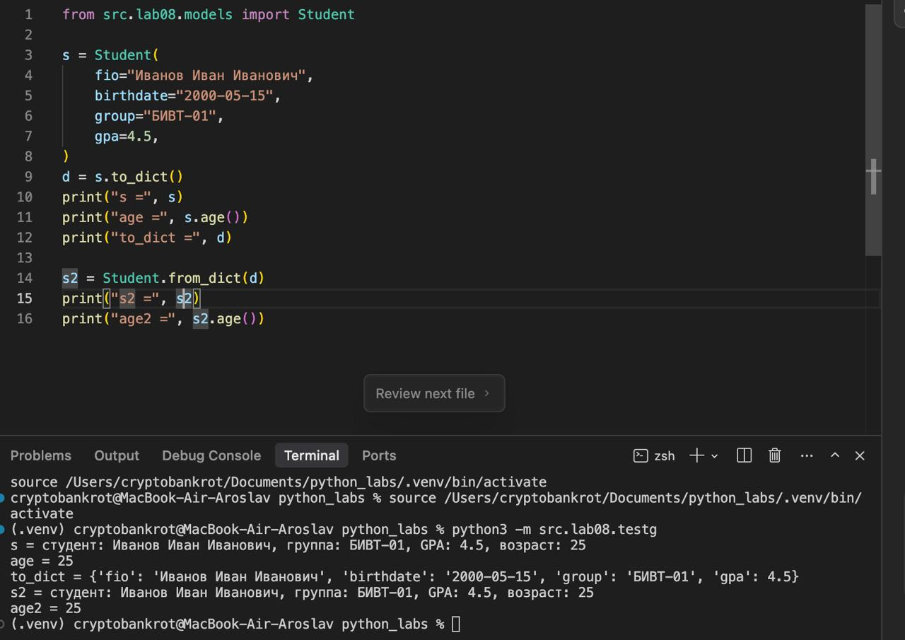
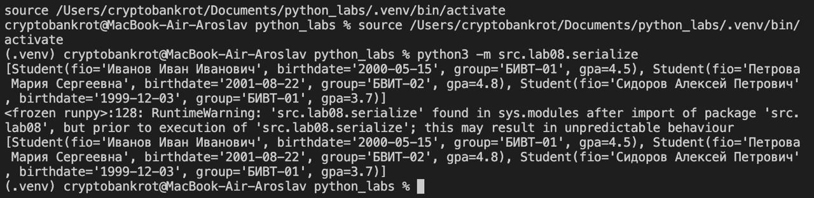

## Лр 8

ООП: классы и объекты

```python
from dataclasses import dataclass
from datetime import datetime, date
from typing import Dict, Any


@dataclass
class Student:
    """
    класс для представления студента
    декоратор @dataclass для автоматической генерации
    методов __init__, __repr__ и тд
    """
    fio: str
    birthdate: str
    group: str
    gpa: float

    def __post_init__(self):
        """
        метод вызывается автоматически после __init__
        используется для валидации данных после создания объекта
        """
        # дата
        try:
            datetime.strptime(self.birthdate, "%Y-%m-%d")
        except ValueError:
            raise ValueError(
                f"Неверный формат даты: {self.birthdate}. "
                f"Ожидается формат YYYY-MM-DD"
            )
        # средний балл
        if not (0 <= self.gpa <= 5):
            raise ValueError(
                f"Средний балл должен быть в диапазоне от 0 до 5, "
                f"получено: {self.gpa}"
            )

    def age(self) -> int:
        """
        вычисляет и возвращает количество полных лет студента
        """
        birth_date = datetime.strptime(self.birthdate, "%Y-%m-%d").date()
        today = date.today()
        age_years = today.year - birth_date.year
        if (today.month, today.day) < (birth_date.month, birth_date.day):
            age_years -= 1
        return age_years

    def to_dict(self) -> Dict[str, Any]:
        """
        сериализует объект Student в словарь
        возвращает словарь со всеми полями класса
        """
        return {
            "fio": self.fio,
            "birthdate": self.birthdate,
            "group": self.group,
            "gpa": self.gpa,
        }

    @classmethod
    def from_dict(cls, pasd: Dict[str, Any]) -> "Student":
        """
        десериализует словарь в объект Student
        это classmethod, поэтому вызывается через класс: Student.from_dict(dict)
        """
        # создаётся новый экземпляр класса, используя значения из словаря
        return cls(
            fio=pasd["fio"],
            birthdate=pasd["birthdate"],
            group=pasd["group"],
            gpa=pasd["gpa"],
        )

    def __str__(self) -> str:
        """
        возвращает строковое представление объекта для пользователя 
        вызывается при использовании str() или print()
        """
        return f"студент: {self.fio}, группа: {self.group}, GPA: {self.gpa}, возраст: {self.age()}"
```

пример запуска:


сделана валидация даты, проверка на то, что день рождения в текущем году мог еще не наступить


# Задание 2

```python
import json
from typing import List
from .models import Student


def students_to_json(students: List[Student], path: str) -> None:
    """
    cериализует список объектов student в JSON-файл
    """
    data = [student.to_dict() for student in students]
    with open(path, "w", encoding="utf-8") as f:
        json.dump(data, f, ensure_ascii=False, indent=2)


def students_from_json(path: str) -> List[Student]:
    """
    Десериализует JSON-файл в список объектов Student.
    
    Args:
        path: Путь к JSON-файлу для чтения
        
    Returns:
        Список объектов Student
    """
    with open(path, encoding="utf-8") as f:
        data = json.load(f)
    students = [Student.from_dict(d) for d in data]
    return students


students = [
    Student(
        fio="Иванов Иван Иванович",
        birthdate="2000-05-15",
        group="БИВТ-01",
        gpa=4.5
    ),
    Student(
        fio="Петрова Мария Сергеевна",
        birthdate="2001-08-22",
        group="БВИТ-02",
        gpa=4.8
    ),
    Student(
        fio="Сидоров Алексей Петрович",
        birthdate="1999-12-03",
        group="БИВТ-01",
        gpa=3.7
    )
]

students_to_json(students, "data/lab08/students_output.json")
```

сериализация с использованием json
код работы с ним взял из 5 лр

пример запуска:
