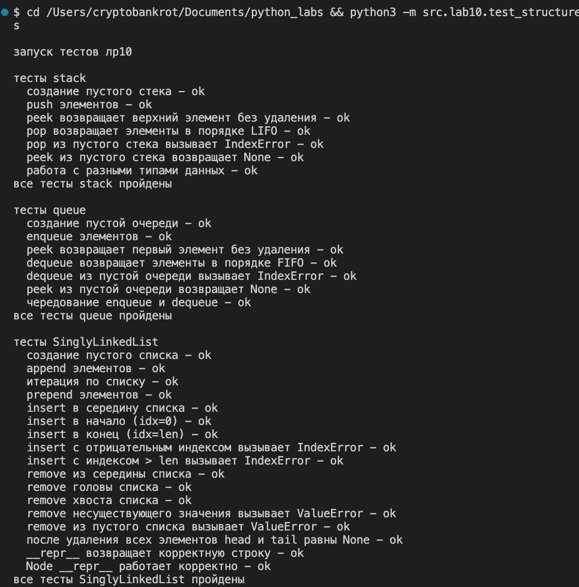

### Лабараторная работа №10(финалочка)
стек - нечестно
очередь - честно

а вообще, у стэка принцип, что тот, кто зашел в конце, выйдет в начале
а у очереди тот, кто зашел в конце, выйдет в конце

из простых примеров: стек - ctrl+z при написаниии кода, у очереди как ни странно обработка задач по очереди

### A
```python
from collections import deque
from typing import Any


class Stack:
    """
    структура данных cтек (LIFO) на базе list
    вершина стека — последний элемент списка
    """
    
    def __init__(self):
        """инициализация пустого стека"""
        self._data: list[Any] = []
    
    def push(self, item: Any) -> None:
        """
        добавить элемент на вершину стека
        
        args:
            item элемент для добавления
        
        сложность O(1) амортизированная
        """
        self._data.append(item)
    
    def pop(self) -> Any:
        """
        снять верхний элемент стека и вернуть его
        
        returns:
            верхний элемент стека
        
        raises:
            IndexError, если стек пуст
        
        сложность O(1)
        """
        if self.is_empty():
            raise IndexError("pop from empty stack")
        return self._data.pop()
    
    def peek(self) -> Any | None:
        """
        вернуть верхний элемент без удаления
        
        returns
            верхний элемент или None, если стек пуст
        
        сложность O(1)
        """
        if self.is_empty():
            return None
        return self._data[-1]
    
    def is_empty(self) -> bool:
        """
        проверить, пуст ли стек
        
        returns
            true если стек пуст, иначе false
        
        сложность O(1)
        """
        return len(self._data) == 0
    
    def __len__(self) -> int:
        """
        вернуть количество элементов в стеке
        
        returns
            количество элементов
        
        сложность O(1)
        """
        return len(self._data)
    


class Queue:
    """
    структура данных «очередь» (FIFO) на базе collections.deque
    голова очереди — левый край структуры (dequeue берёт слева)
    """
    
    def __init__(self):
        """инициализация пустой очереди"""
        self._data: deque[Any] = deque()
    
    def enqueue(self, item: Any) -> None:
        """
        добавить элемент в конец очереди
        
        args:
            item: элемент для добавления
        
        сложность: O(1)
        """
        self._data.append(item)
    
    def dequeue(self) -> Any:
        """
        взять элемент из начала очереди и вернуть его
        
        returns
            первый элемент очереди
        
        raises
            IndexError если очередь пуста
        
        сложность O(1)
        """
        if self.is_empty():
            raise IndexError("dequeue from empty queue")
        return self._data.popleft()
    
    def peek(self) -> Any | None:
        """
        вернуть первый элемент без удаления
        
        returns
            первый элемент или None, если очередь пуста
        
        сложность O(1)
        """
        if self.is_empty():
            return None
        return self._data[0]
    
    def is_empty(self) -> bool:
        """
        проверить, пуста ли очередь
        
        returns:
            true если очередь пуста, иначе false
        
        сложность O(1)
        """
        return len(self._data) == 0
    
    def __len__(self) -> int:
        """
        вернуть количество элементов в очереди
        
        returns
            количество элементов
        
        сложность O(1)
        """
        return len(self._data)
```
(тесты внизу)
Задание B
```python
from typing import Any, Iterator


class Node:
    """
    узел односвязного списка
    
    attributes
        value значение элемента
        next ссылка на следующий узел или None
    """
    
    def __init__(self, value: Any, next: "Node | None" = None):
        self.value = value
        self.next = next
    
    def __repr__(self) -> str:
        return f"Node({self.value})"


class SinglyLinkedList:
    """
    односвязный список с оптимизацией через tail
    
    attributes
        head голова списка (первый элемент) или None
        tail хвост списка (последний элемент) или None
        _size количество элементов в списке
    """
    
    def __init__(self):
        """инициализация пустого списка"""
        self.head: Node | None = None
        self.tail: Node | None = None
        self._size: int = 0
    
    def append(self, value: Any) -> None:
        """
        добавить элемент в конец списка
        
        args
            value значение для добавления
        
        сложность O(1) благодаря tail
        """
        new_node = Node(value)
        
        if self.head is None:
            # список пуст
            self.head = new_node
            self.tail = new_node
        else:
            # добавляем в конец
            self.tail.next = new_node
            self.tail = new_node
        
        self._size += 1
    
    def prepend(self, value: Any) -> None:
        """
        добавить элемент в начало списка
        
        args
            value значение для добавления
        
        сложность O(1)
        """
        new_node = Node(value, next=self.head)
        self.head = new_node
        
        if self.tail is None:
            # список был пуст
            self.tail = new_node
        
        self._size += 1
    
    def insert(self, idx: int, value: Any) -> None:
        """
        вставить элемент по индексу
        
        args
            idx индекс для вставки (0 <= idx <= len)
            value значение для вставки
        
        raises
            IndexError если индекс вне диапазона [0, len]
        
        сложность O(n)
        """
        if idx < 0 or idx > self._size:
            raise IndexError(
                f"индекс {idx} вне диапазона [0, {self._size}]"
            )
        
        if idx == 0:
            self.prepend(value)
            return
        
        if idx == self._size:
            self.append(value)
            return
        current = self.head
        for _ in range(idx - 1):
            current = current.next
        
        new_node = Node(value, next=current.next)
        current.next = new_node
        self._size += 1
    
    def remove(self, value: Any) -> None:
        """
        удалить первое вхождение значения
        
        args
            value значение для удаления
        
        raises
            ValueError если значение не найдено
        
        сложность O(n)
        """
        if self.head is None:
            raise ValueError(f"значение {value} не найдено в списке")
        if self.head.value == value:
            self.head = self.head.next
            self._size -= 1
            
            if self.head is None:
                self.tail = None
            
            return
        
        current = self.head
        while current.next is not None:
            if current.next.value == value:
                if current.next == self.tail:
                    self.tail = current
                
                current.next = current.next.next
                self._size -= 1
                return
            
            current = current.next
        
        raise ValueError(f"значение {value} не найдено в списке")
    
    def __iter__(self) -> Iterator[Any]:
        """
        итератор по значениям списка (от головы к хвосту)
        
        yields
            значения элементов списка
        """
        current = self.head
        while current is not None:
            yield current.value
            current = current.next
    
    def __len__(self) -> int:
        """
        вернуть количество элементов в списке
        
        returns
            количество элементов
        
        сложность O(1)
        """
        return self._size
    
    def __repr__(self) -> str:
        """строковое представление списка"""
        values = list(self)
        return f"SinglyLinkedList({values})"
```


